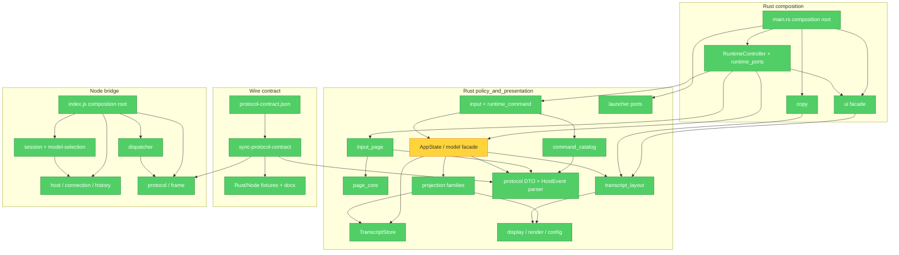

# Brooks-Lint Review

- **Mode:** Architecture Audit
- **Scope:** whole repository; full mapping of `client/` and `bridge/` production modules, sampling `tools/`, `docs/`, and OpenSpec.
- **Health Score:** 94/100
- **Trend:** 59 → 94 (+35, over the last 3 Architecture Audits)

The Rust client's production dependency graph has no SCC; protocol, config, and DSH host compatibility boundaries all have executable guards. The main remaining risk is `AppState`, which is still an oversized state-coordination façade.

---

## Module Dependency Graph

---

## Findings

### 🟡 Warning

**Cognitive Overload — `AppState` is still an oversized state-coordination façade**

- **Symptom:** the production region of `client/src/model.rs` is ~2,447 lines before `#[cfg(test)] mod tests`, and `AppState` simultaneously owns session/page state, queues, Thinking settlement, history prepend, surface mutation application, cache dirty marking, and the landing of multiple projection-family mutations; its public/private method list still spans several abstraction levels. Although the family projectors have been extracted to `projection/`, a maintainer changing one state lifecycle still has to trace the related cache and replay rules inside this large façade.
- **Source:** *Refactoring* — Long Method / Divergent Change; *A Philosophy of Software Design* — Cognitive Load and Deep Modules.
- **Consequence:** a new event family or a change to history/cache semantics more easily re-concentrates what should be local projection work into `model.rs`, increasing review cost and the chance of missing state/cache coupling.
- **Remedy:** keep the existing `TranscriptStore`/projection boundaries; in the next change that touches only a state lifecycle, sink one of the pure session/page state transitions, history replay orchestration, or cache invalidation policy into a clearly named coordinator; do not split merely by line count, and do not restore the legacy `Msg` adapter.

### 🟢 Suggestion

**Cognitive Overload — `ui.rs`'s production tail sits after a large test module**

- **Symptom:** `client/src/ui.rs`'s production façade enters `#[cfg(test)] mod tests` at around line 368, but `color_for` is defined at around line 3,456. Clippy also reports `items_after_test_module`; finding a production UI helper requires crossing a large number of TestBackend regression cases.
- **Source:** *Code Complete* — High-Quality Routines / Locality; *Refactoring* — Long File.
- **Consequence:** this does not break dependency direction, but reduces the UI façade's navigability and makes the production/test boundary less obvious at the source level.
- **Remedy:** move `color_for` before the test module; if UI regression keeps growing, split the TestBackend fixtures into same-directory test submodules along the existing `ui/` families, keeping the public façade and test definitions separate.

---

## Summary

`client/tests/architecture.rs` verifies that the production graph has no SCC, that forbidden reverse edges do not exist, that production transcript has no legacy `Msg`/compatibility reducer, and that Config has a single strict schema/default source; `tools/sync-protocol-contract.mjs --check` and the Rust/Node conformance tests prove the wire derived facts are in sync. `RuntimeController`/`runtime_ports`, `LauncherPorts`, and the Node host/session/model-selection adapter all provide replaceable test seams, and the deployment profile is further validated by `verify-dsh-upgrade` for public DSH exports and `/new`, cold resume, and `/model` routing.

Testability Seam Assessment: pass; I/O and host services all have narrow ports or explicit factory/injection seams, with scripted/unit/deployed-copy tests. Conway's Law: no team-ownership information was found, so no finding. The high fan-out of `main.rs` and `bridge/src/index.js` is explicit composition-root responsibility and is not scored as Dependency Disorder.
