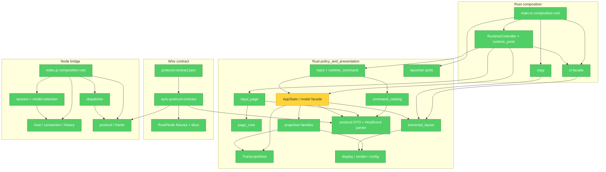

# Brooks-Lint Review

- **Mode:** Architecture Audit
- **Scope:** 整个仓库；完整映射 `client/` 与 `bridge/` 的生产模块，抽样检查 `tools/`、`docs/` 与 OpenSpec。
- **Health Score:** 94/100
- **Trend:** 59 → 94（+35，最近 3 次 Architecture Audit）

Rust 客户端的生产依赖图已无 SCC，协议、配置和 DSH host 兼容边界都有可执行守卫；剩余主要风险是 `AppState` 这个仍然偏大的状态协调 façade。

---

## Module Dependency Graph

---

## Findings

### 🟡 Warning

**Cognitive Overload — `AppState` 仍是过大的状态协调 façade**

- **Symptom:** `client/src/model.rs` 的 production 区域在 `#[cfg(test)] mod tests` 前约 2,447 行，`AppState` 同时拥有 session/page state、队列、Thinking settlement、history prepend、surface mutation 应用、cache dirty 标记和多个 projection-family mutation 的落地；其公开/私有方法列表仍跨越多个抽象层级。虽然 family projector 已拆到 `projection/`，维护者修改一个状态生命周期仍需在这个大 façade 中追踪相关 cache 与 replay 规则。
- **Source:** *Refactoring* — Long Method / Divergent Change；*A Philosophy of Software Design* — Cognitive Load and Deep Modules。
- **Consequence:** 新事件 family 或 history/cache 语义改动更容易把本应局部的投影工作重新集中到 `model.rs`，增加审阅成本并提高遗漏 state/cache coupling 的概率。
- **Remedy:** 保持现有 `TranscriptStore`/projection 边界，在下一次只涉及状态生命周期的变更中，将纯 session/page state transition、history replay orchestration 或 cache invalidation policy 中的一项完整下沉到一个命名明确的 coordinator；不要仅按行数拆分，也不要恢复 legacy `Msg` adapter。

### 🟢 Suggestion

**Cognitive Overload — `ui.rs` 的生产尾项位于大型 test module 之后**

- **Symptom:** `client/src/ui.rs` 的 production façade 在约第 368 行进入 `#[cfg(test)] mod tests`，但 `color_for` 又定义在约第 3,456 行。Clippy 也报告 `items_after_test_module`；查找一个生产 UI helper 时必须跨越大量 TestBackend 回归用例。
- **Source:** *Code Complete* — High-Quality Routines / Locality；*Refactoring* — Long File。
- **Consequence:** 这不会破坏依赖方向，但降低 UI façade 的可导航性，并使生产/测试边界在源码层面不够直观。
- **Remedy:** 将 `color_for` 移到 test module 前；若 UI 回归继续增长，可按现有 `ui/` family 将 TestBackend fixtures 拆到同目录测试子模块，保持公开 façade 与测试定义分离。

---

## Summary

`client/tests/architecture.rs` 已验证 production graph 无 SCC、禁止的反向边不存在、生产 transcript 无 legacy `Msg`/compatibility reducer，且 Config 只有一个严格 schema/default source；`tools/sync-protocol-contract.mjs --check` 与 Rust/Node conformance tests 证明 wire 派生事实同步。`RuntimeController`/`runtime_ports`、`LauncherPorts`、Node host/session/model-selection adapter 都提供了可替换的测试 seam，部署 profile 还通过 `verify-dsh-upgrade` 验证公开 DSH export 和 `/new`、cold resume、`/model` 路由。

Testability Seam Assessment：通过；I/O 与宿主服务均有窄 port 或显式 factory/injection seam，且有 scripted/unit/deployed-copy 测试。Conway's Law：未发现团队归属信息，因此不作 finding。`main.rs` 与 `bridge/src/index.js` 的高 fan-out 是明确的 composition root 责任，不按 Dependency Disorder 计分。
